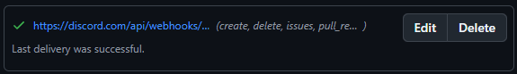

# Webhooks on GitHub

Webhooks allow us to receive notifications whenever some event occurs on GitHub, like when a `push` occurs.

## Creating a webhook on GitHub

To create a webhook on GitHub, first you need to be the owner of the repository or have administrative rights to the repo. 

If that is true, then:

1. On GitHub, navigate to the main page of the repository.
2. Under your repository name, click  **Settings**. If you cannot see the "Settings" tab, select the  dropdown menu, then click **Settings**.
3. In the left sidebar, click  **Webhooks**.
4. Click **Add webhook**.
5. Under **Payload URL**, type the URL where you'd like to receive payloads.
6. Optionally, select the **Content type** drop-down menu, and click a data format to receive the webhook payload in.
	- **application/json** will deliver the JSON payload directly as the body of the `POST` request.
	- **application/x-www-form-urlencoded** will send the JSON payload as a form parameter called `payload`.
7. Optionally, under "Secret", type a string to use as a `secret` key. You should choose a random string of text with high entropy. You can use the webhook secret to limit incoming requests to only those originating from GitHub.
8. Under "Which events would you like to trigger this webhook?", select the webhook events that you want to receive. You should only subscribe to the webhook events that you need.
9. If you chose **Let me select individual events**, select the events that you want to trigger the webhook.
10. To make the webhook active immediately after adding the configuration, select **Active**.
11. Click **Add webhook**.
## Webhooks with Discord

First, we'll start on Discord. Open the channel you want your GitHub logs to go to. 

To proceed with the next step, ensure that you have `Manage Channel` and `Manage Webhooks` permissions for a channel.

### On Discord

Then, do the following:
1. Go in a channel properties (Alternatively, Server Settings, Webhooks works too)
2. Click **Webhooks**
3. Click **Create Webhook**
4. Type in a name (this is for local reference, it's overriden by the incoming hook data)
5. Copy the **Webhook URL** (you can use the Copy button)
6. Click **Save**
#### Note

Do NOT give the Webhook URL out to the public. Anyone or service can post messages to this channel, without even needing to be in the server. Keep it safe!

### On GitHub

Next, we're going to follow the above steps for [[#Creating a webhook on GitHub]]. Here are the steps summarised and changed to match this specific case:

1. Click on **Settings**.
2. Click on **Webhooks**.
3. Click on **Add Webhook**.
4. The **Payload URL** is the webhook URL **with `/github` added to the end**.
5. Leave **Secret** blank, change the **Content-Type** to `application/json`.
6. Select what type of events you want.
7. Click **Add Webhook**.

You should see the following:

#### Note

The `test` payload will not show anything in your channel. That is normal. You will need to actually take an action in order to show any activity. However, make sure the test payload has a green checkmark, and the response is 204.

### Getting a 400 error?

Make sure to add `/github` at the end of the webhook URL.

# References

1. [About webhooks - GitHub Docs](https://docs.github.com/en/webhooks/about-webhooks)
2. [Github to Discord Webhook tutorial.md](https://gist.github.com/SGTGunner/50d6a3cc0d489cf779f77695ba3e22ea)