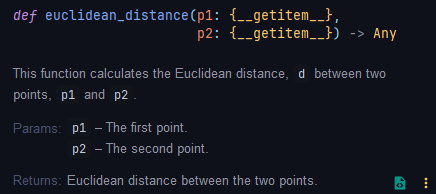

## Adding documentation comments to a function

You can add documentation comments to a function by typing the following at the beginning of the function:

```python
def my_function(parameter_1, parameter_2):
	"""
	Description of the function

	:param parameter_1: Information about parameter_1
	:param parameter_2: Information about parameter_2
	:return: Information about what function returns
	"""
```

Here's an example:

```python
def euclidean_distance(p1, p2):  
    """  
    This function calculates the Euclidean distance, ``d`` between two points, ``p1`` and ``p2``.  
    :param p1: The first point.    
    :param p2: The second point.    
    :return: Euclidean distance between the two points.  
    """    
    d = np.sqrt(((p1[0] - p2[0]) ** 2) + ((p1[1] - p2[1]) ** 2))  
    return d
```

And here's the result in PyCharm:



It will look slightly different from platform to platform, but the needed information will be there for anyone who uses your function to see.